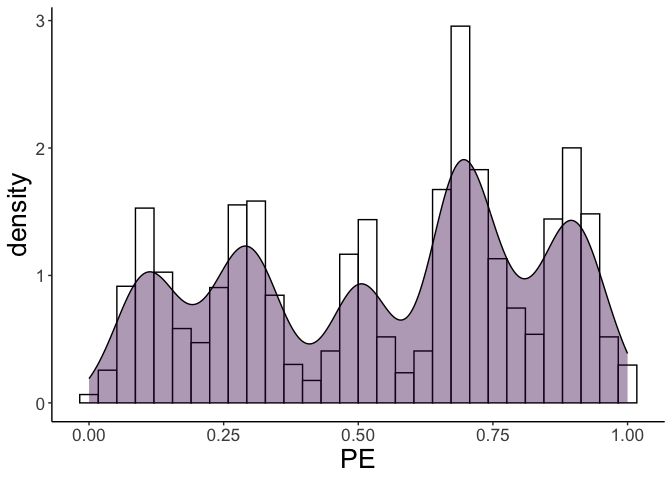
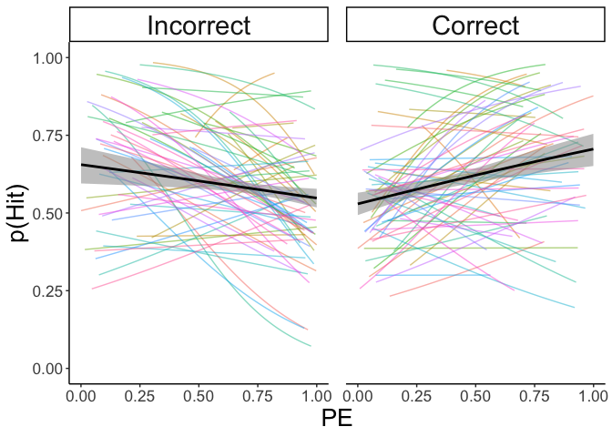
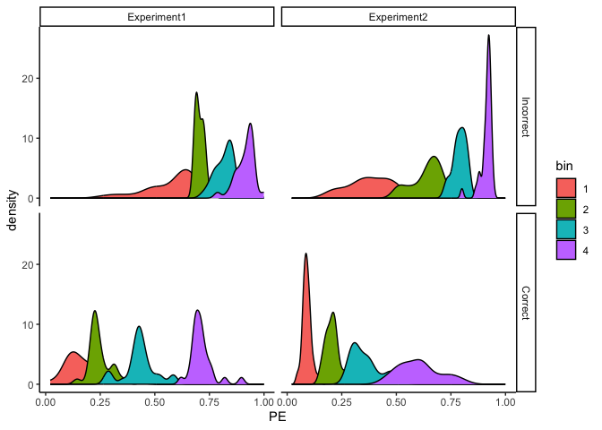
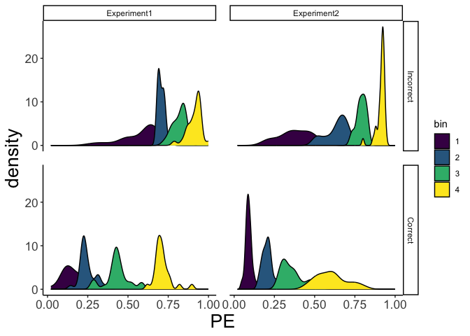
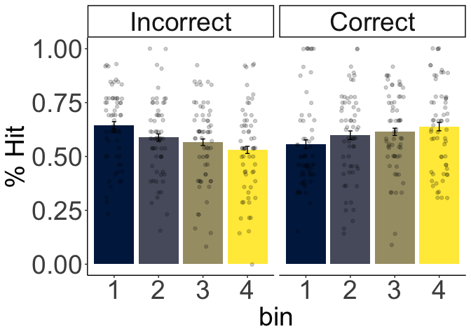
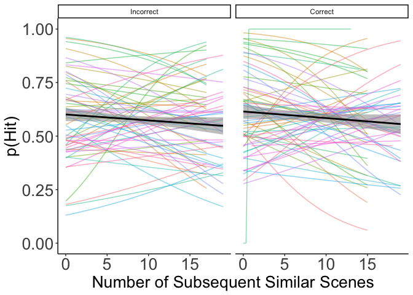

-   [start with getting the exp1
    data](#start-with-getting-the-exp1-data)
-   [Now exp2](#now-exp2)
-   [create PE](#create-pe)
-   [Merge Them](#merge-them)
    -   [Visualize merged data](#visualize-merged-data)
    -   [Analyze now](#analyze-now)
    -   [Analyse with quantiles (contained in the supplementary
        material)](#analyse-with-quantiles-contained-in-the-supplementary-material)
-   [Analysis of recognition as a function of number of subsequent
    scenes](#analysis-of-recognition-as-a-function-of-number-of-subsequent-scenes)

### start with getting the exp1 data

``` r
# get the parent folder
abs<-paste0(dirname(getwd()))

exp1<-read.csv(paste(abs, "/output_files/fittedData.exp1.Phase2.fLR_Instr.csv", sep=""))

# exclude fillers
exp1<-exp1[exp1$pred_Cond!=4,]

# select only immediate
exp1<-exp1[exp1$rec_session=="ImmediateRec",]

# exclude participants with low performance in phase1
exclPhase1<-c(7 ,16, 19, 20, 23)

exp1<-exp1[!exp1$SubNum %in% exclPhase1, ]
```

### Now exp2

``` r
exp2<-read.csv(paste(abs, "/output_files/fittedData.exp2.Phase2.fLR_Instr.csv", sep=""))

# select only immediate
exp2<-exp2[exp2$participant<41 ,]

# select only where practice == 0
exp2<-exp2[exp2$practice==0,]

# delete the fillers
exp2<-exp2[exp2$fillers==0,]

# exclude participants with low performance in phase1
exclPhase1exp2<-c(3 ,13, 28, 36, 39)

exp2<-exp2[!exp2$SubNum %in% exclPhase1exp2, ]
```

### create PE

``` r
# select datasets 
exp1<-getPE(exp1,3)

exp2<-getPE(exp2, 2)

# select the variables of interest
VoI<-c("pe_level", "trialN", "rec_acc", "acc", "rec_session", "SubNum", "PE",
       "rec_Obj", "scene_cat") 

exp1<-exp1[, VoI]
names(exp1)[c(1,3,4,5, 8, 9)]<-c("PE_level",  "id_acc","trial_acc", "session",
                                 "obj_file", "scn_cat")

# convert PE level as factor
exp1$PE_level<-as.factor(exp1$PE_level)

# rename PE levels
levels(exp1$PE_level) <- c("0.9", "0.1", "0.5")

# order the PE
exp1$PE_level<-factor(exp1$PE_level, level = c("0.1", "0.5",  "0.9"))

# create scene condition
exp1$scn_condition<-ifelse(exp1$PE_level=="0.5", "Flat", "Strong")

# rename scene condition
exp2$scn_condition<-as.factor(exp2$scn_condition)

levels(exp2$scn_condition)<-c("Flat", "Weak", "Strong")

#levels(exp1$trial_acc)<-c("Incorrect", "Correct")

## PE by accuracy - exp2
exp2$trial_acc<-as.factor(exp2$trial_acc)

#levels(exp2$trial_acc)<-c("Incorrect", "Correct")   
```

# Merge Them

``` r
exp1$exp<-"Experiment1"
exp2$exp<-"Experiment2"

exp2$session<-as.character(exp2$session)
exp1$session<-as.character(exp1$session)

exp1$PE_level<-as.character(exp1$PE_level)
exp2$PE_level<-as.character(exp2$PE_level)

exp1$scn_condition<-as.character(exp1$scn_condition)
exp2$scn_condition<-as.character(exp2$scn_condition)

# retrieve the learning rates
# experiment 1
# learning rate
exp1lr<-fread(paste0(dirname(abs), "/exp1/outputs/group_level/computational_model/", 
                     "ParameterEstimation.exp1.betalimit=10.initialQ=0.33.fLR_Instr.csv"))

# select the first three rows
exp1lr<-exp1lr[,1:3]

# change the name of the variable indicating the participant
names(exp1lr)[1]<-"SubNum"

exp1<-merge(exp1, exp1lr, by = "SubNum")

# exp 2
exp2lr<-fread(paste0(dirname(abs),"/exp2/outputs/group_level/computational_model/", 
                     "ParameterEstimation.exp2.betalimit=10.initialQ=0.5.fLR_Instr.csv"))

# select the first three rows
exp2lr<-exp2lr[,1:3]

# change the name of the variable indicating the participant
names(exp2lr)[1]<-"SubNum"

exp2<-merge(exp2, exp2lr, by = "SubNum")

# add "2" in front of the subnum
exp2$SubNum<-exp2$SubNum+200
exp2<-exp2[, names(exp1)]

# merge thetwo
allData<-data.frame(rbind(exp1,exp2 ))

# rename prediction accuracy
allData$trial_acc<-ifelse(allData$trial_acc==0, "Incorrect", "Correct")

# make the "incorrect" level the baseline
allData$trial_acc<-as.factor(allData$trial_acc)
allData$trial_acc<-relevel(allData$trial_acc, ref = "Incorrect")
```

Save it

``` r
setwd(dirname(getwd()))
getwd()
```

    ## [1] "/Users/francescopupillo/PowerFolders/Frankfurt_University/PIVOTAL/PREMUP_computational/scripts"

``` r
write.csv(allData, paste0(abs,"/output_files/fittedData_exp1-exp2_fLR_Instr.csv"))
```

### Visualize merged data

``` r
# plot merged data
# with the histogram
PEDistrExpN<-ggplot(allData, aes(x= PE, fill = ""))

PEDistrExpN+
  geom_histogram(aes(y = ..density..),
                 colour = 1, fill = "white") +
  
  geom_density(alpha=.4,show.legend = FALSE)+
  theme_classic()+
  theme(
    plot.title = element_text(size = 22),
    axis.title.x = element_text(size = 20),
    axis.title.y = element_text(size = 20),
    axis.text=element_text(size=13)
  )+
  scale_fill_viridis_d()
```

    ## Warning: The dot-dot notation (`..density..`) was deprecated in ggplot2 3.4.0.
    ## ℹ Please use `after_stat(density)` instead.
    ## This warning is displayed once every 8 hours.
    ## Call `lifecycle::last_lifecycle_warnings()` to see where this warning was
    ## generated.

    ## `stat_bin()` using `bins = 30`. Pick better value with `binwidth`.



``` r
ggsave(paste0(abs, "/figures/PE_instr_distrNOscene.exp1.exp2.png"), 
       width = 5, height = 5)
```

    ## `stat_bin()` using `bins = 30`. Pick better value with `binwidth`.

``` r
# Now PE and recognition accuracy
# plot it first
print(
  ggplot(allData, aes( x=PE, y=id_acc))+
    geom_line(stat="smooth",method = "glm", formula=y~x,method.args=list(family="binomial"), alpha=0.5)+
    aes(colour = factor(SubNum), alpha=0.3)+
    geom_smooth(method="glm",formula=y~x,method.args=list(family="binomial"), colour="black", se=T)+
    theme(strip.text.x = element_text(size = 13))+ ylim(c(0,1))+
    facet_grid(.~trial_acc)+
    theme_classic()+
    theme(
      plot.title = element_text(size = 22),
      axis.title.x = element_text(size = 20),
      axis.title.y = element_text(size = 20),
      axis.text=element_text(size=13),
    )+
    theme(strip.text.x = element_text(size = 22))+
    theme(panel.spacing = unit(1, "lines"))+
    
    #ggtitle("Experiment 2")+
    theme(legend.position = "none")+
    ylab("p(Hit)")
)
```



``` r
# save it
ggsave(paste0(abs, "/figures/PE_mem_fLR_instr.exp1.exp2.png"), 
       width = 7, height = 7)
```

### Analyze now

``` r
# we need to center PE
allData$PE.c <- scale(allData$PE, center=TRUE, scale=FALSE)

# center learning rate
allData$alpha.c <- scale(allData$alpha, center=TRUE, scale=FALSE)

# center experiment 
allData$exp.c <- ifelse(allData$exp == "Experiment1", -0.5, 0.5)

# center prediction outcome
allData$trial_acc.c <- ifelse(allData$trial_acc == "Incorrect", -0.5, 0.5)

# generalized linear mixed-effects
PEbyAccAll.c<-glmer(id_acc~PE.c*trial_acc.c*alpha.c*exp.c+(trial_acc.c*PE.c|SubNum), family= binomial, 
                    data = allData,
                    control=glmerControl(optimizer="bobyqa",optCtrl=list(maxfun=100000)))
```

    ## boundary (singular) fit: see help('isSingular')

``` r
summary(PEbyAccAll.c) 
```

    ## Generalized linear mixed model fit by maximum likelihood (Laplace
    ##   Approximation) [glmerMod]
    ##  Family: binomial  ( logit )
    ## Formula: id_acc ~ PE.c * trial_acc.c * alpha.c * exp.c + (trial_acc.c *  
    ##     PE.c | SubNum)
    ##    Data: allData
    ## Control: glmerControl(optimizer = "bobyqa", optCtrl = list(maxfun = 1e+05))
    ## 
    ##      AIC      BIC   logLik deviance df.resid 
    ##   7531.0   7704.2  -3739.5   7479.0     5742 
    ## 
    ## Scaled residuals: 
    ##     Min      1Q  Median      3Q     Max 
    ## -3.5655 -1.0377  0.5643  0.8357  1.8004 
    ## 
    ## Random effects:
    ##  Groups Name             Variance  Std.Dev. Corr             
    ##  SubNum (Intercept)      0.2998067 0.54755                   
    ##         trial_acc.c      0.0008781 0.02963   0.71            
    ##         PE.c             0.0301761 0.17371   0.86  0.97      
    ##         trial_acc.c:PE.c 0.0327456 0.18096   0.14 -0.60 -0.38
    ## Number of obs: 5768, groups:  SubNum, 62
    ## 
    ## Fixed effects:
    ##                                Estimate Std. Error z value Pr(>|z|)    
    ## (Intercept)                     0.66039    0.09999   6.605 3.98e-11 ***
    ## PE.c                           -0.12287    0.18853  -0.652  0.51460    
    ## trial_acc.c                     0.10446    0.10307   1.013  0.31083    
    ## alpha.c                         0.68337    2.25288   0.303  0.76164    
    ## exp.c                          -0.63253    0.19961  -3.169  0.00153 ** 
    ## PE.c:trial_acc.c                1.86764    0.36697   5.089 3.59e-07 ***
    ## PE.c:alpha.c                    1.96142    3.46207   0.567  0.57102    
    ## trial_acc.c:alpha.c             2.91226    2.04554   1.424  0.15453    
    ## PE.c:exp.c                     -0.09478    0.37347  -0.254  0.79967    
    ## trial_acc.c:exp.c               0.19242    0.20326   0.947  0.34381    
    ## alpha.c:exp.c                   4.00875    4.47203   0.896  0.37004    
    ## PE.c:trial_acc.c:alpha.c        0.90679    5.80778   0.156  0.87593    
    ## PE.c:trial_acc.c:exp.c         -0.93396    0.73427  -1.272  0.20339    
    ## PE.c:alpha.c:exp.c             -1.95359    6.84097  -0.286  0.77521    
    ## trial_acc.c:alpha.c:exp.c       3.53298    4.04648   0.873  0.38261    
    ## PE.c:trial_acc.c:alpha.c:exp.c  5.17902   11.03045   0.470  0.63870    
    ## ---
    ## Signif. codes:  0 '***' 0.001 '**' 0.01 '*' 0.05 '.' 0.1 ' ' 1

    ## 
    ## Correlation matrix not shown by default, as p = 16 > 12.
    ## Use print(x, correlation=TRUE)  or
    ##     vcov(x)        if you need it

    ## optimizer (bobyqa) convergence code: 0 (OK)
    ## boundary (singular) fit: see help('isSingular')

``` r
# exponentiate the beta for OR
betas<-as.data.frame(summary(PEbyAccAll.c)$coefficients)

OR<-cbind(row.names(betas),exp(betas$Estimate))

Anova(PEbyAccAll.c, type = "III")
```

    ## Analysis of Deviance Table (Type III Wald chisquare tests)
    ## 
    ## Response: id_acc
    ##                                  Chisq Df Pr(>Chisq)    
    ## (Intercept)                    43.6230  1  3.981e-11 ***
    ## PE.c                            0.4247  1    0.51460    
    ## trial_acc.c                     1.0271  1    0.31083    
    ## alpha.c                         0.0920  1    0.76164    
    ## exp.c                          10.0418  1    0.00153 ** 
    ## PE.c:trial_acc.c               25.9010  1  3.594e-07 ***
    ## PE.c:alpha.c                    0.3210  1    0.57102    
    ## trial_acc.c:alpha.c             2.0269  1    0.15453    
    ## PE.c:exp.c                      0.0644  1    0.79967    
    ## trial_acc.c:exp.c               0.8962  1    0.34381    
    ## alpha.c:exp.c                   0.8035  1    0.37004    
    ## PE.c:trial_acc.c:alpha.c        0.0244  1    0.87593    
    ## PE.c:trial_acc.c:exp.c          1.6179  1    0.20339    
    ## PE.c:alpha.c:exp.c              0.0816  1    0.77521    
    ## trial_acc.c:alpha.c:exp.c       0.7623  1    0.38261    
    ## PE.c:trial_acc.c:alpha.c:exp.c  0.2204  1    0.63870    
    ## ---
    ## Signif. codes:  0 '***' 0.001 '**' 0.01 '*' 0.05 '.' 0.1 ' ' 1

``` r
# get bootstrapped confidenceßß intervals
#CI<-confint(PEbyAccAll.c, method=c("boot"), boot.type=c("norm"))
# save the bootstrapped confidence intervals, as it it a very time consuming computation
#save(CI, file = "CI.Rdata")
# load the data
load("S.CI.Rdata")

CI
```

    ##                                       2.5 %      97.5 %
    ## .sig01                           0.42895113  0.70049603
    ## .sig02                          -0.09806908  2.64470003
    ## .sig03                           0.18798977  2.30266190
    ## .sig04                          -1.12947275  1.39683947
    ## .sig05                          -0.25607571  0.08826104
    ## .sig06                           0.18537909  2.62614355
    ## .sig07                          -2.70956822  0.14794843
    ## .sig08                          -0.23717707  0.37751317
    ## .sig09                          -2.24648189  0.68979397
    ## .sig10                          -0.76039599  0.46726009
    ## (Intercept)                      0.46225159  0.84946582
    ## PE.c                            -0.45449199  0.22173458
    ## trial_acc.c                     -0.07715052  0.28634254
    ## alpha.c                         -3.74859631  5.18850565
    ## exp.c                           -1.00874372 -0.22846141
    ## PE.c:trial_acc.c                 1.17570979  2.53027101
    ## PE.c:alpha.c                    -3.25877184  6.82912094
    ## trial_acc.c:alpha.c             -0.49564491  6.34369985
    ## PE.c:exp.c                      -0.84763946  0.63281923
    ## trial_acc.c:exp.c               -0.20445246  0.59845792
    ## alpha.c:exp.c                   -4.83039717 13.14587933
    ## PE.c:trial_acc.c:alpha.c        -5.75190104  6.79732741
    ## PE.c:trial_acc.c:exp.c          -2.28073564  0.47544789
    ## PE.c:alpha.c:exp.c             -10.62157529  7.02976022
    ## trial_acc.c:alpha.c:exp.c       -2.99574264 10.39178837
    ## PE.c:trial_acc.c:alpha.c:exp.c  -2.09178138 12.93429388

``` r
#intervals(PEbyAccAll.c)

# in the positive side
PEbyAccAllPos<-glmer(id_acc~PE+(PE|SubNum), family= binomial, 
                     data = allData[allData$trial_acc=="Correct",],
                     control=glmerControl(optimizer="bobyqa",optCtrl=list(maxfun=100000)))
```

    ## boundary (singular) fit: see help('isSingular')

``` r
summary(PEbyAccAllPos)
```

    ## Generalized linear mixed model fit by maximum likelihood (Laplace
    ##   Approximation) [glmerMod]
    ##  Family: binomial  ( logit )
    ## Formula: id_acc ~ PE + (PE | SubNum)
    ##    Data: allData[allData$trial_acc == "Correct", ]
    ## Control: glmerControl(optimizer = "bobyqa", optCtrl = list(maxfun = 1e+05))
    ## 
    ##      AIC      BIC   logLik deviance df.resid 
    ##   3380.5   3409.7  -1685.2   3370.5     2560 
    ## 
    ## Scaled residuals: 
    ##     Min      1Q  Median      3Q     Max 
    ## -2.7559 -1.0490  0.5705  0.8380  1.3551 
    ## 
    ## Random effects:
    ##  Groups Name        Variance Std.Dev. Corr
    ##  SubNum (Intercept) 0.2021   0.4496       
    ##         PE          0.1061   0.3257   1.00
    ## Number of obs: 2565, groups:  SubNum, 62
    ## 
    ## Fixed effects:
    ##             Estimate Std. Error z value Pr(>|z|)    
    ## (Intercept)  0.16426    0.09806   1.675   0.0939 .  
    ## PE           0.79949    0.20351   3.929 8.55e-05 ***
    ## ---
    ## Signif. codes:  0 '***' 0.001 '**' 0.01 '*' 0.05 '.' 0.1 ' ' 1
    ## 
    ## Correlation of Fixed Effects:
    ##    (Intr)
    ## PE -0.549
    ## optimizer (bobyqa) convergence code: 0 (OK)
    ## boundary (singular) fit: see help('isSingular')

``` r
# in the negative side
PEbyAccAllNeg<-glmer(id_acc~PE+(PE|SubNum), family= binomial, 
                     data = allData[allData$trial_acc=="Incorrect",],
                     control=glmerControl(optimizer="bobyqa",optCtrl=list(maxfun=100000)))

summary(PEbyAccAllNeg)
```

    ## Generalized linear mixed model fit by maximum likelihood (Laplace
    ##   Approximation) [glmerMod]
    ##  Family: binomial  ( logit )
    ## Formula: id_acc ~ PE + (PE | SubNum)
    ##    Data: allData[allData$trial_acc == "Incorrect", ]
    ## Control: glmerControl(optimizer = "bobyqa", optCtrl = list(maxfun = 1e+05))
    ## 
    ##      AIC      BIC   logLik deviance df.resid 
    ##   4208.0   4238.4  -2099.0   4198.0     3198 
    ## 
    ## Scaled residuals: 
    ##     Min      1Q  Median      3Q     Max 
    ## -2.3367 -1.0425  0.5794  0.8226  1.7951 
    ## 
    ## Random effects:
    ##  Groups Name        Variance Std.Dev. Corr 
    ##  SubNum (Intercept) 0.3138   0.5602        
    ##         PE          0.2609   0.5107   -0.15
    ## Number of obs: 3203, groups:  SubNum, 62
    ## 
    ## Fixed effects:
    ##             Estimate Std. Error z value Pr(>|z|)    
    ## (Intercept)   0.9133     0.1780   5.130 2.89e-07 ***
    ## PE           -0.7815     0.2256  -3.464 0.000533 ***
    ## ---
    ## Signif. codes:  0 '***' 0.001 '**' 0.01 '*' 0.05 '.' 0.1 ' ' 1
    ## 
    ## Correlation of Fixed Effects:
    ##    (Intr)
    ## PE -0.870

### Analyse with quantiles (contained in the supplementary material)

``` r
# create a vector
binnedData<-vector()
for (s in unique(allData$SubNum)){
  
  tryCatch({
    
    # subset participant
    currdf<-allData[allData$SubNum==s,]
    
    for (trial_acc in c("Correct","Incorrect")){
      
      currfacc<-currdf[currdf$trial_acc==trial_acc,]
      
      # get quantiles
      quantiles<-quantile(currfacc$PE)
      
      # assign quantiles
      currfacc$quantile<-NA
      for (n in 1:nrow(currfacc)){
        if (currfacc$PE[n]>=quantiles[1] & currfacc$PE[n]<quantiles[2]){
          currfacc$quantile[n]<-1  
        } else if(currfacc$PE[n]>=quantiles[2] & currfacc$PE[n]<quantiles[3]){
          currfacc$quantile[n]<-2
          
        } else if (currfacc$PE[n]>=quantiles[3] & currfacc$PE[n]<quantiles[4]){
          currfacc$quantile[n]<-3
        } else if (currfacc$PE[n]>=quantiles[4] ){
          currfacc$quantile[n]<-4
        } 
      }
      
      # create mean of id_acc and P by quantile
      df<-currfacc %>%
        group_by(quantile) %>%
        dplyr::summarise(PE = mean(PE), id_acc = mean(id_acc),
                         #PE_level = unique(PE_level), 
                         SubNum = unique(SubNum), 
                         trial_acc = unique(trial_acc),
                         exp = unique(exp))
      
      
      binnedData<-rbind(binnedData, as.data.frame(df))   
    }
  },  error=function(e){cat("ERROR :",conditionMessage(e), "\n")})  
}

# visualize
binnedData$quantile<-as.factor(binnedData$quantile)

binnedData$bin<-(binnedData$quantile)

# plot
PlotBind<-ggplot(binnedData, aes(x= PE, fill=bin))
print(
  PlotBind+geom_density()+ facet_grid( trial_acc~ exp)+theme_classic()
  
)+
  theme(
    plot.title = element_text(size = 22),
    axis.title.x = element_text(size = 20),
    axis.title.y = element_text(size = 20),
    axis.text=element_text(size=13)
  )+
  scale_fill_viridis_d()+
  theme(panel.spacing = unit(1, "lines"))
```



``` r
ggsave(paste0(abs, "/figures/PEdistr_binned.png"), 
       width = 7, height = 7)

# take the se within-participant
data_agg<-binnedData %>%
  group_by(bin,  trial_acc, SubNum) %>%
  dplyr::summarise(id_acc = mean(id_acc, na.rm = T))
```

    ## `summarise()` has grouped output by 'bin', 'trial_acc'. You can override using
    ## the `.groups` argument.

``` r
library(Rmisc)
```

    ## Loading required package: lattice
    ## Loading required package: plyr
    ## ------------------------------------------------------------------------------
    ## You have loaded plyr after dplyr - this is likely to cause problems.
    ## If you need functions from both plyr and dplyr, please load plyr first, then dplyr:
    ## library(plyr); library(dplyr)
    ## ------------------------------------------------------------------------------
    ## 
    ## Attaching package: 'plyr'
    ## 
    ## The following object is masked from 'package:ggpubr':
    ## 
    ##     mutate
    ## 
    ## The following objects are masked from 'package:dplyr':
    ## 
    ##     arrange, count, desc, failwith, id, mutate, rename, summarise,
    ##     summarize

``` r
dat_summary <- summarySEwithin(data_agg,
                               measurevar = "id_acc",
                               withinvars = c("bin", "trial_acc"), 
                               idvar = "SubNum")

data_agg$bin<-as.factor(data_agg$bin)
gplotquant<-ggplot(data_agg, aes( x=bin, y=id_acc))+
  geom_bar(aes(bin, id_acc, fill = bin),
           position="dodge",stat="summary", fun.y="mean", SE=F)+
  
  geom_errorbar(aes(y = id_acc, ymin = id_acc - se, ymax = id_acc + se),
                color = "black", width = 0.10, data=dat_summary)+
  geom_jitter(width = 0.20, alpha = 0.2)+
  
  facet_wrap(trial_acc~.)+
  theme_classic()+
  ylab("% Hit")+
  theme(legend.position = "none")+
  theme(
    plot.title = element_text(size = 30),
    axis.title.x = element_text(size = 28),
    axis.title.y = element_text(size = 28),
    axis.text=element_text(size=28)
  )+
  theme(strip.text.x = element_text(size = 28))+
  scale_fill_viridis_d(option = "cividis")
```

    ## Warning in geom_bar(aes(bin, id_acc, fill = bin), position = "dodge", stat =
    ## "summary", : Ignoring unknown parameters: `fun.y` and `SE`

``` r
print(gplotquant)
```

    ## No summary function supplied, defaulting to `mean_se()`
    ## No summary function supplied, defaulting to `mean_se()`



``` r
ggsave(paste0(abs, "/figures/binnedPE_mem.png"), 
       width = 10, height = 10)
```

    ## No summary function supplied, defaulting to `mean_se()`
    ## No summary function supplied, defaulting to `mean_se()`

``` r
PEquant<-lmer(id_acc~bin*trial_acc*exp+(bin+trial_acc|SubNum), 
              data = binnedData)
```

    ## boundary (singular) fit: see help('isSingular')

``` r
summary(PEquant)   
```

    ## Linear mixed model fit by REML. t-tests use Satterthwaite's method [
    ## lmerModLmerTest]
    ## Formula: id_acc ~ bin * trial_acc * exp + (bin + trial_acc | SubNum)
    ##    Data: binnedData
    ## 
    ## REML criterion at convergence: -372.1
    ## 
    ## Scaled residuals: 
    ##      Min       1Q   Median       3Q      Max 
    ## -2.54818 -0.63914  0.05206  0.59265  2.48452 
    ## 
    ## Random effects:
    ##  Groups   Name             Variance  Std.Dev. Corr                   
    ##  SubNum   (Intercept)      0.0142278 0.11928                         
    ##           bin2             0.0094995 0.09747  -0.19                  
    ##           bin3             0.0033067 0.05750   0.04  0.84            
    ##           bin4             0.0026641 0.05161   0.01  0.07  0.28      
    ##           trial_accCorrect 0.0007345 0.02710   0.33 -0.76 -0.91 -0.30
    ##  Residual                  0.0165560 0.12867                         
    ## Number of obs: 496, groups:  SubNum, 62
    ## 
    ## Fixed effects:
    ##                                       Estimate Std. Error        df t value
    ## (Intercept)                            0.70655    0.03377  95.04577  20.925
    ## bin2                                  -0.07067    0.03973 145.33716  -1.779
    ## bin3                                  -0.07018    0.03673 176.39904  -1.911
    ## bin4                                  -0.09106    0.03640 175.73585  -2.502
    ## trial_accCorrect                      -0.06397    0.03541 255.13524  -1.807
    ## expExperiment2                        -0.10885    0.04494  95.04596  -2.422
    ## bin2:trial_accCorrect                  0.07815    0.04953 240.00734   1.578
    ## bin3:trial_accCorrect                  0.06597    0.04953 240.00735   1.332
    ## bin4:trial_accCorrect                  0.18609    0.04953 240.00734   3.758
    ## bin2:expExperiment2                    0.02388    0.05287 145.33723   0.452
    ## bin3:expExperiment2                   -0.01582    0.04888 176.39907  -0.324
    ## bin4:expExperiment2                   -0.04183    0.04845 175.73601  -0.863
    ## trial_accCorrect:expExperiment2       -0.04245    0.04712 255.13501  -0.901
    ## bin2:trial_accCorrect:expExperiment2   0.03672    0.06592 240.00722   0.557
    ## bin3:trial_accCorrect:expExperiment2   0.12470    0.06592 240.00722   1.892
    ## bin4:trial_accCorrect:expExperiment2   0.01787    0.06592 240.00723   0.271
    ##                                      Pr(>|t|)    
    ## (Intercept)                           < 2e-16 ***
    ## bin2                                 0.077334 .  
    ## bin3                                 0.057653 .  
    ## bin4                                 0.013279 *  
    ## trial_accCorrect                     0.071986 .  
    ## expExperiment2                       0.017330 *  
    ## bin2:trial_accCorrect                0.115870    
    ## bin3:trial_accCorrect                0.184085    
    ## bin4:trial_accCorrect                0.000215 ***
    ## bin2:expExperiment2                  0.652250    
    ## bin3:expExperiment2                  0.746583    
    ## bin4:expExperiment2                  0.389106    
    ## trial_accCorrect:expExperiment2      0.368564    
    ## bin2:trial_accCorrect:expExperiment2 0.577986    
    ## bin3:trial_accCorrect:expExperiment2 0.059728 .  
    ## bin4:trial_accCorrect:expExperiment2 0.786534    
    ## ---
    ## Signif. codes:  0 '***' 0.001 '**' 0.01 '*' 0.05 '.' 0.1 ' ' 1

    ## 
    ## Correlation matrix not shown by default, as p = 16 > 12.
    ## Use print(x, correlation=TRUE)  or
    ##     vcov(x)        if you need it

    ## optimizer (nloptwrap) convergence code: 0 (OK)
    ## boundary (singular) fit: see help('isSingular')

``` r
Anova(PEquant, type="III")
```

    ## Analysis of Deviance Table (Type III Wald chisquare tests)
    ## 
    ## Response: id_acc
    ##                      Chisq Df Pr(>Chisq)    
    ## (Intercept)       437.8478  1  < 2.2e-16 ***
    ## bin                 7.1345  3   0.067733 .  
    ## trial_acc           3.2642  1   0.070808 .  
    ## exp                 5.8663  1   0.015434 *  
    ## bin:trial_acc      14.5385  3   0.002257 ** 
    ## bin:exp             1.6775  3   0.641940    
    ## trial_acc:exp       0.8114  1   0.367715    
    ## bin:trial_acc:exp   4.2261  3   0.238066    
    ## ---
    ## Signif. codes:  0 '***' 0.001 '**' 0.01 '*' 0.05 '.' 0.1 ' ' 1

``` r
# dropping the setup
PEquantInt<-lmer(id_acc~quantile*trial_acc+(quantile+trial_acc|SubNum), 
                 data = binnedData)
```

    ## boundary (singular) fit: see help('isSingular')

``` r
summary(PEquantInt)
```

    ## Linear mixed model fit by REML. t-tests use Satterthwaite's method [
    ## lmerModLmerTest]
    ## Formula: id_acc ~ quantile * trial_acc + (quantile + trial_acc | SubNum)
    ##    Data: binnedData
    ## 
    ## REML criterion at convergence: -388.8
    ## 
    ## Scaled residuals: 
    ##      Min       1Q   Median       3Q      Max 
    ## -2.58492 -0.66247  0.05302  0.64158  2.64931 
    ## 
    ## Random effects:
    ##  Groups   Name             Variance  Std.Dev. Corr                   
    ##  SubNum   (Intercept)      0.0181269 0.13464                         
    ##           quantile2        0.0094584 0.09725  -0.26                  
    ##           quantile3        0.0034076 0.05837  -0.14  0.88            
    ##           quantile4        0.0025874 0.05087   0.18 -0.03  0.10      
    ##           trial_accCorrect 0.0005979 0.02445   0.31 -0.80 -0.95 -0.30
    ##  Residual                  0.0166401 0.12900                         
    ## Number of obs: 496, groups:  SubNum, 62
    ## 
    ## Fixed effects:
    ##                             Estimate Std. Error        df t value Pr(>|t|)    
    ## (Intercept)                  0.64510    0.02368  91.43976  27.242  < 2e-16 ***
    ## quantile2                   -0.05719    0.02626 148.03693  -2.178 0.030960 *  
    ## quantile3                   -0.07911    0.02433 179.83538  -3.252 0.001368 ** 
    ## quantile4                   -0.11467    0.02405 180.21941  -4.768 3.83e-06 ***
    ## trial_accCorrect            -0.08793    0.02338 257.33913  -3.762 0.000209 ***
    ## quantile2:trial_accCorrect   0.09888    0.03277 244.00031   3.018 0.002815 ** 
    ## quantile3:trial_accCorrect   0.13637    0.03277 244.00032   4.162 4.38e-05 ***
    ## quantile4:trial_accCorrect   0.19618    0.03277 244.00030   5.987 7.58e-09 ***
    ## ---
    ## Signif. codes:  0 '***' 0.001 '**' 0.01 '*' 0.05 '.' 0.1 ' ' 1
    ## 
    ## Correlation of Fixed Effects:
    ##             (Intr) quntl2 quntl3 quntl4 trl_cC qn2:_C qn3:_C
    ## quantile2   -0.519                                          
    ## quantile3   -0.496  0.546                                   
    ## quantile4   -0.435  0.421  0.467                            
    ## trl_ccCrrct -0.455  0.387  0.434  0.467                     
    ## qntl2:trl_C  0.346 -0.624 -0.337 -0.341 -0.701              
    ## qntl3:trl_C  0.346 -0.312 -0.673 -0.341 -0.701  0.500       
    ## qntl4:trl_C  0.346 -0.312 -0.337 -0.681 -0.701  0.500  0.500
    ## optimizer (nloptwrap) convergence code: 0 (OK)
    ## boundary (singular) fit: see help('isSingular')

``` r
library(lsmeans)
```

    ## Loading required package: emmeans
    ## The 'lsmeans' package is now basically a front end for 'emmeans'.
    ## Users are encouraged to switch the rest of the way.
    ## See help('transition') for more information, including how to
    ## convert old 'lsmeans' objects and scripts to work with 'emmeans'.

``` r
lsmeans(PEquantInt, pairwise~quantile*trial_acc)
```

    ## $lsmeans
    ##  quantile trial_acc lsmean     SE   df lower.CL upper.CL
    ##  1        Incorrect  0.645 0.0237 89.2    0.598    0.692
    ##  2        Incorrect  0.588 0.0246 86.7    0.539    0.637
    ##  3        Incorrect  0.566 0.0241 88.0    0.518    0.614
    ##  4        Incorrect  0.530 0.0254 84.8    0.480    0.581
    ##  1        Correct    0.557 0.0246 86.7    0.508    0.606
    ##  2        Correct    0.599 0.0242 87.7    0.551    0.647
    ##  3        Correct    0.614 0.0241 88.0    0.567    0.662
    ##  4        Correct    0.639 0.0260 83.5    0.587    0.690
    ## 
    ## Degrees-of-freedom method: kenward-roger 
    ## Confidence level used: 0.95 
    ## 
    ## $contrasts
    ##  contrast                                  estimate     SE    df t.ratio
    ##  quantile1 Incorrect - quantile2 Incorrect  0.05719 0.0263 144.1   2.178
    ##  quantile1 Incorrect - quantile3 Incorrect  0.07911 0.0243 166.1   3.252
    ##  quantile1 Incorrect - quantile4 Incorrect  0.11467 0.0241 169.9   4.768
    ##  quantile1 Incorrect - quantile1 Correct    0.08793 0.0234 243.8   3.762
    ##  quantile1 Incorrect - quantile2 Correct    0.04624 0.0252  95.6   1.832
    ##  quantile1 Incorrect - quantile3 Correct    0.03067 0.0236 102.4   1.299
    ##  quantile1 Incorrect - quantile4 Correct    0.00642 0.0240 100.6   0.268
    ##  quantile2 Incorrect - quantile3 Incorrect  0.02191 0.0242 168.3   0.907
    ##  quantile2 Incorrect - quantile4 Incorrect  0.05748 0.0271 136.2   2.119
    ##  quantile2 Incorrect - quantile1 Correct    0.03074 0.0276  88.6   1.115
    ##  quantile2 Incorrect - quantile2 Correct   -0.01095 0.0234 243.8  -0.469
    ##  quantile2 Incorrect - quantile3 Correct   -0.02652 0.0247  97.6  -1.073
    ##  quantile2 Incorrect - quantile4 Correct   -0.05077 0.0282  87.1  -1.801
    ##  quantile3 Incorrect - quantile4 Incorrect  0.03556 0.0250 158.0   1.424
    ##  quantile3 Incorrect - quantile1 Correct    0.00882 0.0254  95.1   0.347
    ##  quantile3 Incorrect - quantile2 Correct   -0.03287 0.0240 100.6  -1.370
    ##  quantile3 Incorrect - quantile3 Correct   -0.04844 0.0234 243.8  -2.072
    ##  quantile3 Incorrect - quantile4 Correct   -0.07269 0.0258  93.8  -2.819
    ##  quantile4 Incorrect - quantile1 Correct   -0.02674 0.0245  98.5  -1.092
    ##  quantile4 Incorrect - quantile2 Correct   -0.06843 0.0264  91.9  -2.594
    ##  quantile4 Incorrect - quantile3 Correct   -0.08400 0.0245  98.4  -3.425
    ##  quantile4 Incorrect - quantile4 Correct   -0.10825 0.0234 243.8  -4.631
    ##  quantile1 Correct - quantile2 Correct     -0.04169 0.0263 144.1  -1.588
    ##  quantile1 Correct - quantile3 Correct     -0.05726 0.0243 166.1  -2.354
    ##  quantile1 Correct - quantile4 Correct     -0.08151 0.0241 169.9  -3.389
    ##  quantile2 Correct - quantile3 Correct     -0.01557 0.0242 168.3  -0.644
    ##  quantile2 Correct - quantile4 Correct     -0.03982 0.0271 136.2  -1.468
    ##  quantile3 Correct - quantile4 Correct     -0.02425 0.0250 158.0  -0.971
    ##  p.value
    ##   0.3710
    ##   0.0295
    ##   0.0001
    ##   0.0051
    ##   0.6005
    ##   0.8973
    ##   1.0000
    ##   0.9851
    ##   0.4083
    ##   0.9520
    ##   0.9998
    ##   0.9610
    ##   0.6214
    ##   0.8448
    ##   1.0000
    ##   0.8687
    ##   0.4360
    ##   0.1027
    ##   0.9572
    ##   0.1717
    ##   0.0195
    ##   0.0002
    ##   0.7568
    ##   0.2714
    ##   0.0193
    ##   0.9982
    ##   0.8231
    ##   0.9778
    ## 
    ## Degrees-of-freedom method: kenward-roger 
    ## P value adjustment: tukey method for comparing a family of 8 estimates

``` r
# 0 and 1 separately
PEquantNeg<-lmer(id_acc~quantile+(1|SubNum), 
                 data = binnedData[binnedData$trial_acc=="Incorrect",])

summary(PEquantNeg)
```

    ## Linear mixed model fit by REML. t-tests use Satterthwaite's method [
    ## lmerModLmerTest]
    ## Formula: id_acc ~ quantile + (1 | SubNum)
    ##    Data: binnedData[binnedData$trial_acc == "Incorrect", ]
    ## 
    ## REML criterion at convergence: -192.6
    ## 
    ## Scaled residuals: 
    ##      Min       1Q   Median       3Q      Max 
    ## -2.58216 -0.60701  0.09426  0.62348  1.98251 
    ## 
    ## Random effects:
    ##  Groups   Name        Variance Std.Dev.
    ##  SubNum   (Intercept) 0.01815  0.1347  
    ##  Residual             0.01625  0.1275  
    ## Number of obs: 248, groups:  SubNum, 62
    ## 
    ## Fixed effects:
    ##              Estimate Std. Error        df t value Pr(>|t|)    
    ## (Intercept)   0.64510    0.02356 132.93200  27.387  < 2e-16 ***
    ## quantile2    -0.05719    0.02289 183.00000  -2.498 0.013359 *  
    ## quantile3    -0.07911    0.02289 183.00000  -3.456 0.000682 ***
    ## quantile4    -0.11467    0.02289 183.00000  -5.009 1.28e-06 ***
    ## ---
    ## Signif. codes:  0 '***' 0.001 '**' 0.01 '*' 0.05 '.' 0.1 ' ' 1
    ## 
    ## Correlation of Fixed Effects:
    ##           (Intr) quntl2 quntl3
    ## quantile2 -0.486              
    ## quantile3 -0.486  0.500       
    ## quantile4 -0.486  0.500  0.500

``` r
Anova(PEquantNeg)
```

    ## Analysis of Deviance Table (Type II Wald chisquare tests)
    ## 
    ## Response: id_acc
    ##           Chisq Df Pr(>Chisq)    
    ## quantile 26.454  3  7.661e-06 ***
    ## ---
    ## Signif. codes:  0 '***' 0.001 '**' 0.01 '*' 0.05 '.' 0.1 ' ' 1

``` r
#lsmeans(PEquantNeg, pairwise~quantile)

PEquantPos<-lmer(id_acc~quantile+(1|SubNum), 
                 data = binnedData[binnedData$trial_acc=="Correct",])

summary(PEquantPos)     
```

    ## Linear mixed model fit by REML. t-tests use Satterthwaite's method [
    ## lmerModLmerTest]
    ## Formula: id_acc ~ quantile + (1 | SubNum)
    ##    Data: binnedData[binnedData$trial_acc == "Correct", ]
    ## 
    ## REML criterion at convergence: -124.9
    ## 
    ## Scaled residuals: 
    ##      Min       1Q   Median       3Q      Max 
    ## -2.17972 -0.68554  0.03449  0.65284  2.70561 
    ## 
    ## Random effects:
    ##  Groups   Name        Variance Std.Dev.
    ##  SubNum   (Intercept) 0.01723  0.1313  
    ##  Residual             0.02324  0.1525  
    ## Number of obs: 248, groups:  SubNum, 62
    ## 
    ## Fixed effects:
    ##              Estimate Std. Error        df t value Pr(>|t|)    
    ## (Intercept)   0.55717    0.02555 158.06639  21.807  < 2e-16 ***
    ## quantile2     0.04169    0.02738 183.00000   1.522  0.12961    
    ## quantile3     0.05726    0.02738 183.00000   2.091  0.03790 *  
    ## quantile4     0.08151    0.02738 183.00000   2.977  0.00331 ** 
    ## ---
    ## Signif. codes:  0 '***' 0.001 '**' 0.01 '*' 0.05 '.' 0.1 ' ' 1
    ## 
    ## Correlation of Fixed Effects:
    ##           (Intr) quntl2 quntl3
    ## quantile2 -0.536              
    ## quantile3 -0.536  0.500       
    ## quantile4 -0.536  0.500  0.500

# Analysis of recognition as a function of number of subsequent scenes

``` r
# load the function
source(paste0(abs,"/helper_functions/get_number_subs_scenes.R"))

# create the variables indicating the number of subsequent scene for each image
allData<-get_number_subs_scenes(allData)

# create the model
ggplot(allData, aes( x=num_subs_scene, y=id_acc))+
  geom_line(stat="smooth",method = "glm", formula=y~x,method.args=list(family="binomial"), alpha=0.5)+
  aes(colour = factor(SubNum), alpha=0.3)+
  geom_smooth(method="glm",formula=y~x,method.args=list(family="binomial"), colour="black", se=T)+
  theme(strip.text.x = element_text(size = 13))+ ylim(c(0,1))+
  facet_grid(.~trial_acc)+
  theme_classic()+
  theme(
    plot.title = element_text(size = 22),
    axis.title.x = element_text(size = 20),
    axis.title.y = element_text(size = 20),
    axis.text=element_text(size=20)
  )+
  theme(legend.position = "none")+
  xlab("Number of Subsequent Similar Scenes")+
  ylab("p(Hit)")
```

    ## Warning: Removed 62 rows containing non-finite values (`stat_smooth()`).

    ## Warning: glm.fit: algorithm did not converge

    ## Warning: glm.fit: fitted probabilities numerically 0 or 1 occurred

    ## Warning: Removed 62 rows containing non-finite values (`stat_smooth()`).



``` r
ggsave(paste0(abs, "/figures/number_subs_scenes_mem.png"), 
       width = 7, height = 7)
```

    ## Warning: Removed 62 rows containing non-finite values (`stat_smooth()`).

    ## Warning: glm.fit: algorithm did not converge

    ## Warning: glm.fit: fitted probabilities numerically 0 or 1 occurred

    ## Warning: Removed 62 rows containing non-finite values (`stat_smooth()`).

``` r
# Analyze
model_scenenum<-glmer(id_acc~num_subs_scene*trial_acc +(num_subs_scene*trial_acc|SubNum), 
                      family = binomial, data = allData)
```

    ## boundary (singular) fit: see help('isSingular')

``` r
summary(model_scenenum)
```

    ## Generalized linear mixed model fit by maximum likelihood (Laplace
    ##   Approximation) [glmerMod]
    ##  Family: binomial  ( logit )
    ## Formula: id_acc ~ num_subs_scene * trial_acc + (num_subs_scene * trial_acc |  
    ##     SubNum)
    ##    Data: allData
    ## 
    ##      AIC      BIC   logLik deviance df.resid 
    ##   7483.0   7576.1  -3727.5   7455.0     5692 
    ## 
    ## Scaled residuals: 
    ##     Min      1Q  Median      3Q     Max 
    ## -2.9057 -1.0494  0.5853  0.8387  1.6734 
    ## 
    ## Random effects:
    ##  Groups Name                            Variance  Std.Dev. Corr             
    ##  SubNum (Intercept)                     0.5606943 0.74880                   
    ##         num_subs_scene                  0.0007806 0.02794  -0.71            
    ##         trial_accCorrect                0.0017712 0.04209   0.60 -0.27      
    ##         num_subs_scene:trial_accCorrect 0.0001340 0.01158  -0.56 -0.01 -0.92
    ## Number of obs: 5706, groups:  SubNum, 62
    ## 
    ## Fixed effects:
    ##                                  Estimate Std. Error z value Pr(>|z|)    
    ## (Intercept)                      0.425642   0.118096   3.604 0.000313 ***
    ## num_subs_scene                  -0.008583   0.008186  -1.048 0.294411    
    ## trial_accCorrect                 0.094939   0.105383   0.901 0.367642    
    ## num_subs_scene:trial_accCorrect -0.003092   0.011211  -0.276 0.782688    
    ## ---
    ## Signif. codes:  0 '***' 0.001 '**' 0.01 '*' 0.05 '.' 0.1 ' ' 1
    ## 
    ## Correlation of Fixed Effects:
    ##             (Intr) nm_sb_ trl_cC
    ## num_sbs_scn -0.695              
    ## trl_ccCrrct -0.367  0.493       
    ## nm_sbs_s:_C  0.264 -0.585 -0.835
    ## optimizer (Nelder_Mead) convergence code: 0 (OK)
    ## boundary (singular) fit: see help('isSingular')

``` r
Anova(model_scenenum, type = "II")
```

    ## Analysis of Deviance Table (Type II Wald chisquare tests)
    ## 
    ## Response: id_acc
    ##                           Chisq Df Pr(>Chisq)
    ## num_subs_scene           2.2234  1     0.1359
    ## trial_acc                1.4870  1     0.2227
    ## num_subs_scene:trial_acc 0.0761  1     0.7827
